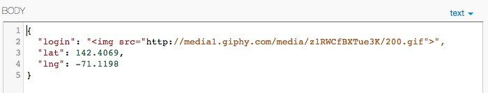

Security Assessment of WhereInTheWorld
=====================================
*A Briefing by ScottyMJacobson* 

12/6/2014 

##Introduction
I was brought in to perform a cursory analysis and penetration testing for Laura Hofmann's WhereInTheWorld API. The API, which stores and retrieves location data through a number of endpoints, in many ways serves as a middleman between an end-user and a MongoDB held remotely on MongoLab. As such, and given that it is a public website, it is responsible for putting up a line of defense between the world and the database, and, like any responsible website, it should not put its users at risk should it be compromised. It fails at these tasks in several ways, as I have outlined below.

##Methodology
To perform these tests, I utilized a chrome add-on named DHC, which provides a GUI for performing HTTP requests as well as a few features such as recall that make it preferable to cURL. The first few tests I did were using the black-box testing methodology - testing, with no knowledge of the code, for the most common vulnerabilities I may find (and in doing so I found issues 1, 2, and 3).  Reading through the application's source code allowed me to recognize that issue 4 would be possible, and after some trial and error, I managed to exploit it. 

##Abstract of Findings
The POST API seems to be most at risk, as three vulnerabilities were found. The first of these looks to be the result of a fairly straightforward programmer's error, and doesn't pose any risk to the application (provided it is patched), but could undermine an end-user's trust in the WhereInTheWorld API, so it should be fixed. The second problem may be the most serious - Cross Site Scripting is a classic attack, and one that is often the first that hackers will use to attempt to compromise a site. The scripts that are put in the database by hackers could end up running on unsuspecting users' computers if they visit the WhereInTheWorld homepage, and could be used to launch phishing attacks or any number of other things. It should be fixed as soon as possible. The third problem, where bad input still enters the database, isn't too much of a problem, but could cause  the database to be polluted with bad entries if a user isn't careful. The fourth problem exposes the entire contents of the database to users, which is severe as soon as the database contains anything sensitive. Such an exposure should be treated promptly. 

##Issues Found
1. **Improper JSON Formatting of Response Messages** - *Priority:* **Low**
   - Affects POST API
   - The main risk here would be to an application that relies on the WhereInTheWorld API. If the application doesn't very carefully handle the response a POST request, it will most likely get this malformed response back, expect it to be JSON (as expressed in 	its header), handle it as such, and then crash. Priority here is listed as low because it doesn't pose any immediate threat to the WhereInTheWorld site itself.
   - *A POST body of*  
	 *resulted in:* 
	- The fix is quite trivial: the method used to send the response out should be changed from response.send to response.json("Error Message Here"), which will automatically enclose the string in a JSON object and make the response valid.
	

2. **Cross-Site-Scripting/NoSQL Injection:** - *Priority:* **High**
	- Affects POST API
	- Injection of Cross-Site-Scripts is a classic issue that has plagued databases since the beginning of time, and it comes through in classic fashion here. The user's input in the username field has not been escaped at all, which gives a nefarious user the ability to inject the database with HTML tags including images, videos, or even dangerous scripts. The raw content gets outputted straight to the screen as HTML when the '/' directory is accessed, as can be seen in the screenshots. Priority here is High because Cross-Side-Scripting can have crippling effects on a website, making it inoperable, install malware on users' computer, or a vessel for phishing.
	- *A POST body of*  *resulted in:* 
	- The fix here is more involved. On the POST API itself, the input for the username field is sanitized: it is reasonable to assume that usernames should be strictly alphanumeric, so any POSTs containing non-alphanumeric usernames should possibly be rejected outright. A quick and dirty solution would match against the whitelisted regex expression /^[0-9a-z]+$/, using a function that looks like `if (!username.match(/^[0-9a-z]+$/)) { //reject input }`. However, we'd rather not ignore our international friends by assuming that all characters are ASCII, so perhaps it'd be better to avoid reinventing the wheel and instead use one of the great Node.JS packages for input validating and sanitization, such as the aptly-titled `express-validator`, and implement its validation and sanitization methods as part of the route that handles POST requests. Ideally, this same validation and sanitization would be done once the data is fetched from the database, to try to ensure that even if a piece of corrupt data ended up in the database, the website would not be compromised.  

	
3. **Non-Numerical Location Data Enters into Database as `null` value** - *Priority:*  **Low**
	- Affects POST API
	- The data entered into the POST API is validated to make sure the numbers passed in the lat and lng fields are actually floats, except if that validation fails, an object is still inserted into the database containing null values for any fields that don't pass validation. 
	- *A POST body of*  
	  
	*resulted in the following entry:* 
	- This was fixed by wrapping the database insertion step of the POST route in an `if (passedValidation)` statement, where passedValidation is a boolean that becomes false if any of the validation conditions that were being checked for are violated. The priority here is low because the main risk is to the database if it gets filled with bad entries, and to any users of WhereInTheWorld that may not be able to handle entries with unpopulated fields.

4. **Execution of Arbitrary NoSQL Queries** - *Priority:* **Medium/High** 
	- Affects GET /locations.json API
	- Upon examining the source code, I noticed that the URL-encoded query string passed into the `?login=...` parameter is naïvely passed into the `find()` call in the database without being validated or sanitized. I realized that this left the door open for queries to be passed into the field, and after several attempts at getting the correct syntax that would let the queries be passed straight through, I succeeded at creating an empty object that contains the query, which is interpreted by MongoDB as running that query on that object, as demonstrated below:
	- *A Post Body of* 
	 *resulted in:* 
	- The fix for this involves validating the input for the username field here as we need for problem #2 - using that same function to validate, we end up with the request being rejected as invalid if it contains the $ that would indicate a MongoDB query. Like issue 2, we could also use an already-made validator library with perhaps fewer limiting effects as these considerations have been taken care of by previous programmers. The priority is listed as ambiguous between medium or high because it depends on the nature of the database - the /locations.json API provides a subset of the data anyway without authorization, this data doesn't seem to need to be protected. However, a clever hacker could use this vulnerability to view the entire contents of the collection whether or not it had a username parameter, so if the database was holding sensitive information, it would be exposed.

 
Conclusion
----------
Though the problems here are quite urgent, it may be misleading to see that none are particularly catastrophic for the functionality of the API. However, given the recent rise in cybersecurity attacks, and with them, rising public awareness on the topic, it would be naive to assume that WhereInTheWorld would be spared such an attack. Such an attack would almost surely defame the name of the app and its developers, and so these days, any and all precautions must be taken in the name of security. At an estimated cost of $500, an investment in shoring up these vulnerabilities is surely a smart investment to make.   